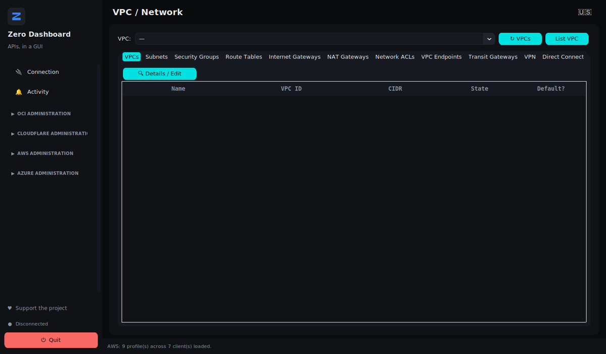

# Zero Dashboard

**AWS, Azure, OCI and Cloudflare in one native desktop window.**

Free · Runs locally · No telemetry · No intermediate server

[Download](https://zerodashboard.com.br/#downloads) ·
[Documentation](docs/en/) ·
[Video](docs/en/videos.md) ·
[Website](https://zerodashboard.com.br/) ·
[Português](README.pt-BR.md)

---

Zero Dashboard is a native desktop panel for sysadmins and DevOps who run
day-to-day operations across more than one cloud. Instead of keeping four
browser consoles open, you get one window: start and stop instances, inspect
networks, audit security rules, manage DNS, and push Cloudflare rules in bulk.

It authenticates with the **profiles you already have on your machine** —
`~/.aws`, `~/.oci/config`, Azure CLI. No sign-up, no new account, no token
handed to a third party.

## Why it exists

Web consoles are slow, and they are one cloud each. An operator who manages
AWS, Azure and OCI at the same time spends the day switching tabs, logging in
again, and hunting for the same information in three different layouts. Zero
Dashboard puts the routine operations — the ones you do every week — behind a
single sidebar.

## What it does

| Provider | Covered |
|---|---|
| **OCI** | Compute, VCN and networking, Storage (block, boot, buckets, Archive Tier restore), VPN/DRG, Search Logs, Email Delivery, Suppression List |
| **AWS** | EC2, S3, VPC and networking (subnets, security groups, route tables, NACLs, IGW, NAT, Transit Gateway, VPN, Direct Connect), Load Balancers, Route 53, Elastic IPs |
| **Azure** | Virtual Machines, Blob Storage, VNet and networking, Virtual WAN, Load Balancer, Application Gateway, DNS Zones, Public IPs |
| **Cloudflare** | Firewall Events, Zones, DNS Records, WAF Custom Rules, IP Access Rules (bulk), Tunnels, Access Apps, Zero Trust users |

The full, itemised inventory is in **[docs/en/features.md](docs/en/features.md)**.

## Getting started

1. **Download** the installer for your system from
   [zerodashboard.com.br](https://zerodashboard.com.br/#downloads) —
   `.exe` for Windows, `.deb` and `.rpm` for Linux.
2. **Install.** No Python runtime and no extra packages to set up.
3. **Open it.** Your existing cloud profiles are detected on startup.

Full instructions, including the Windows SmartScreen warning and how to verify
the checksum, are in **[docs/en/installation.md](docs/en/installation.md)**.

Setting up cloud profiles for the first time?
See **[docs/en/cloud-profiles.md](docs/en/cloud-profiles.md)**.

## Languages

The interface ships in **English (US)** and **Portuguese (Brazil)**. English is
the default; the flag in the top-left corner switches between them, and the
choice is remembered.

## Privacy

The app sends no usage data, no credentials and no telemetry anywhere. Your
cloud credentials stay on your machine, and every operation runs directly
against the providers' own APIs — there is no server in between.

What it reads, what it writes, and where, is documented in
**[docs/en/security.md](docs/en/security.md)**.

## Licence

**Free, and proprietary.** No cost, no trial period, no activation key.

Free does not mean open source: the rights to the software remain with the
author. You may pass on the original installer, unmodified and free of charge.
Redistributing a modified version, reselling, sublicensing or reverse
engineering is not permitted.

Full terms: [LICENSE.en.txt](LICENSE.en.txt) (courtesy translation) —
[LICENSE.txt](LICENSE.txt) is the binding Brazilian Portuguese version.

## Support the project

The software is free and stays free. Keeping it running has costs — the domain,
hosting, and the Windows code-signing certificate that would remove the
SmartScreen warning on first run.

A donation is voluntary. It does not buy a licence, a feature, priority or
support, and the software is identical for those who donate and those who
don't. → [zerodashboard.com.br/#apoiar](https://zerodashboard.com.br/#apoiar)

## Contact

- Website — [zerodashboard.com.br](https://zerodashboard.com.br/)
- Email — contato@zerodashboard.com.br
- Issues and suggestions — the **Issues** tab of this repository

---

This repository holds the public material for Zero Dashboard: documentation,
release notes and videos. The application's source code is not published here.

