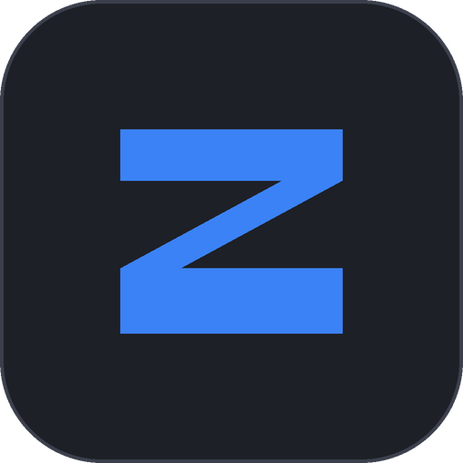
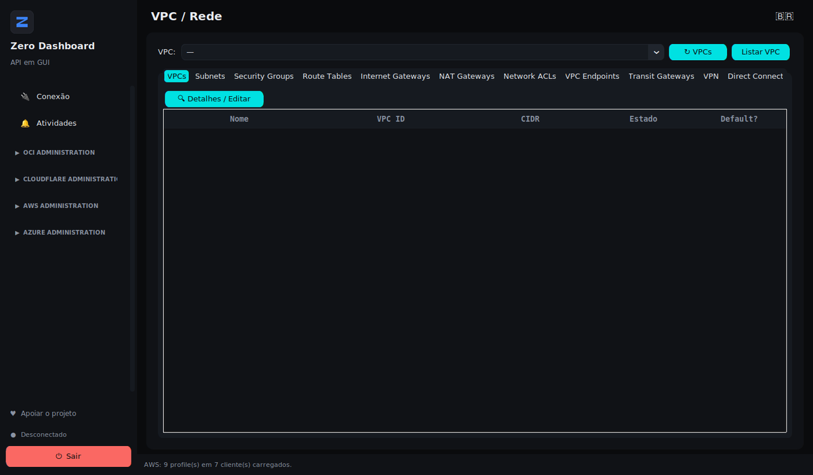

# Zero Dashboard

**AWS, Azure, OCI e Cloudflare numa janela nativa só.**

Gratuito · Roda local · Sem telemetria · Sem servidor intermediário

[Baixar](https://zerodashboard.com.br/#downloads) ·
[Documentação](docs/pt-BR/) ·
[Vídeo](docs/pt-BR/videos.md) ·
[Site](https://zerodashboard.com.br/) ·
[English](README.md)

---

O Zero Dashboard é um painel desktop nativo para SysAdmins e DevOps que operam
mais de uma nuvem no dia a dia. Em vez de manter quatro consoles abertos no
navegador, você tem uma janela: ligar e desligar instâncias, conferir redes,
auditar regras de segurança, mexer em DNS e aplicar regras da Cloudflare em
lote.

A autenticação usa os **perfis que você já tem na máquina** — `~/.aws`,
`~/.oci/config`, Azure CLI. Sem cadastro, sem conta nova, sem entregar token
para terceiro nenhum.

## Por que ele existe

Console web é lento, e é um por nuvem. Quem administra AWS, Azure e OCI ao
mesmo tempo passa o dia trocando de aba, logando de novo e procurando a mesma
informação em três layouts diferentes. O Zero Dashboard coloca as operações de
rotina — as que você faz toda semana — atrás de uma sidebar só.

## O que ele faz

| Provedor | Coberto |
|---|---|
| **OCI** | Compute, VCN e rede, Storage (block, boot, buckets, restore de Archive Tier), VPN/DRG, Search Logs, Email Delivery, Suppression List |
| **AWS** | EC2, S3, VPC e rede (subnets, security groups, route tables, NACLs, IGW, NAT, Transit Gateway, VPN, Direct Connect), Load Balancers, Route 53, Elastic IPs |
| **Azure** | Virtual Machines, Blob Storage, VNet e rede, Virtual WAN, Load Balancer, Application Gateway, DNS Zones, Public IPs |
| **Cloudflare** | Firewall Events, Zones, DNS Records, WAF Custom Rules, IP Access Rules (em lote), Tunnels, Access Apps, usuários Zero Trust |

O inventário completo, item a item, está em
**[docs/pt-BR/features.md](docs/pt-BR/features.md)**.

## Começando

1. **Baixe** o instalador do seu sistema em
   [zerodashboard.com.br](https://zerodashboard.com.br/#downloads) —
   `.exe` para Windows, `.deb` e `.rpm` para Linux.
2. **Instale.** Sem runtime Python e sem pacote adicional para configurar.
3. **Abra.** Os perfis de nuvem que você já tem são detectados na inicialização.

As instruções completas, incluindo o aviso do SmartScreen do Windows e como
conferir o checksum, estão em
**[docs/pt-BR/installation.md](docs/pt-BR/installation.md)**.

É a primeira vez configurando perfis de nuvem?
Veja **[docs/pt-BR/cloud-profiles.md](docs/pt-BR/cloud-profiles.md)**.

## Idiomas

A interface vem em **inglês (EUA)** e **português (Brasil)**. O inglês é o
padrão; a bandeira no canto superior esquerdo alterna entre os dois, e a
escolha fica salva.

## Privacidade

O app não envia dado de uso, credencial nem telemetria para lugar nenhum. As
credenciais de nuvem ficam na sua máquina, e cada operação vai direto contra a
API do próprio provedor — não há servidor no meio.

O que ele lê, o que ele grava, e onde, está documentado em
**[docs/pt-BR/security.md](docs/pt-BR/security.md)**.

## Licença

**Gratuito, e proprietário.** Sem custo, sem período de teste, sem chave de
ativação.

Gratuito não quer dizer código aberto: os direitos sobre o software continuam
com o autor. Repassar o instalador original, sem modificação e sem cobrar por
isso, é permitido. Redistribuir versão alterada, revender, sublicenciar ou
fazer engenharia reversa, não.

Termos completos: [LICENSE.txt](LICENSE.txt) — é a versão que vale. A
[LICENSE.en.txt](LICENSE.en.txt) é tradução de cortesia.

## Apoiar o projeto

O software é gratuito e continua gratuito. Manter ele em pé tem custo — o
domínio, a hospedagem, e o certificado de assinatura de código do Windows, que
é o que tiraria o aviso do SmartScreen na primeira execução.

Doação é voluntária. Não compra licença, funcionalidade, prioridade nem
suporte, e o software é idêntico para quem doa e para quem não doa.
→ [zerodashboard.com.br/#apoiar](https://zerodashboard.com.br/#apoiar)

## Contato

- Site — [zerodashboard.com.br](https://zerodashboard.com.br/)
- E-mail — contato@zerodashboard.com.br
- Dúvidas e sugestões — aba **Issues** deste repositório

---

Este repositório guarda o material público do Zero Dashboard: documentação,
notas de versão e vídeos. O código-fonte da aplicação não é publicado aqui.

